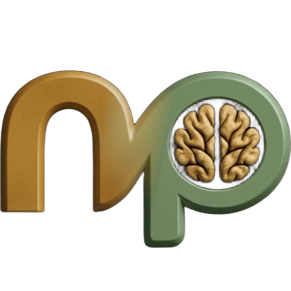

<div align="center">
  
  <h1>NutPro</h1>
  <p><b>La plataforma integral para nutricionistas y pacientes</b></p>

  
  
  
  
</div>

---

## 🚀 Sobre el Proyecto

**NutPro** es una aplicación moderna y multiplataforma diseñada para optimizar el trabajo de los dietistas-nutricionistas y mejorar la experiencia de sus pacientes. Permite gestionar desde la agenda y facturación del profesional, hasta el seguimiento diario, visualización de menús y chat en tiempo real por parte del paciente.

---

## 📱 Prueba la App (Android)

Si deseas probar la experiencia móvil directamente en tu dispositivo sin configurar el entorno de desarrollo:

1. Dirígete a la sección de [**Releases**](https://github.com/MarioGangosoFerreras/NutPro/releases) de este repositorio.
2. Descarga el archivo `.apk` de la versión más reciente.
3. En tu dispositivo Android, abre el archivo descargado para iniciar la instalación.
   - *Nota: Es posible que debas permitir la "Instalación de aplicaciones de fuentes desconocidas" en los ajustes de seguridad de tu teléfono.*
4. ¡Inicia sesión y comienza a gestionar tus planes nutricionales!

---

## ✨ Características Principales

### 🧑‍⚕️ Para el Profesional (Nutricionista)
- **Panel de Control:** Visión general de pacientes, citas y estado de facturación.
- **Gestión Clínica:** Fichas con cálculo automático de IMC e ICC y evolución gráfica.
- **Planes y Recetas:** Configurador de macros, conexión con *Open Food Facts* y menús semanales.
- **Agenda:** Calendario con sincronización bidireccional con **Google Calendar**.
- **Chat:** Comunicación directa en tiempo real.
- **Facturación:** Generación automática de facturas en PDF.


### 👤 Para el Paciente
- **Mi Dieta:** Menú semanal y recetas con detalle de macros.
- **Evolución:** Registro de hábitos (agua, sueño, fruta) y gráficas de peso.
- **Citas:** Gestión de sesiones y enlaces a videollamadas.
- **Documentos:** Historial de facturas e informes compartidos.


---

## 🛠️ Tecnologías y Arquitectura

* **Frontend:** Angular 21 y Ionic UI Components.
* **Backend:** Supabase (Auth, DB, Realtime, Edge Functions).
* **Móvil:** Capacitor para compilación nativa.
* **Servicios:** Cloudinary (Imágenes) y Google Calendar API.

---

## 💻 Instalación y Desarrollo Local

### 📋 Requisitos Previos
* **Node.js** (v18+)
* **Angular CLI** (`npm install -g @angular/cli`)
* **Android Studio** (Para compilación móvil)

### 🛠️ Pasos para ejecutar
1. **Clonar:** `git clone <URL_REPOSITORIO>` y `cd nutpro`
2. **Dependencias:** `npm install`
3. **Servidor:** `ng serve` (Accede en `http://localhost:4200/`).

### 🌐 Ejecución en Red Local (Pruebas en dispositivos reales)
Para probar la aplicación en tu móvil u otros dispositivos conectados a la misma red Wi-Fi:
1. **Ejecutar servidor externo:**
   ```bash
   ng serve --host 0.0.0.0
   ```
2. **Acceder:** Identifica la IP local de tu ordenador (Ej: `192.168.1.15`) y abre en el navegador de tu móvil: `http://192.168.1.15:4200`.

### 🤖 Sincronización y Actualización en Android
Si realizas cambios en el código de Angular y deseas verlos reflejados en el proyecto de Android Studio/Dispositivo móvil:
1. **Generar el build de producción:**
   ```bash
   npm run build
   ```
2. **Sincronizar cambios con Capacitor:**
   ```bash
   npx cap sync android
   ```
3. **Abrir el proyecto en Android Studio:**
   ```bash
   npx cap open android
   ```
*Desde Android Studio, puedes ejecutar el proyecto directamente en un emulador o un dispositivo físico conectado por USB.*

---

## 📂 Estructura del Proyecto
* `/src/app/core/` - Servicios globales, guards de autenticación e integraciones (Auth, Supabase, Cloudinary).
* `/src/app/features/` - Módulos principales separados por dominio:
    * `/admin/` - Panel de administrador.
    * `/ajustes/` - Configuración de cuenta y sincronización (Google Calendar).
    * `/alimentacion/` - Base de datos de recetas e ingredientes.
    * `/auth/` - Login, Registro y flujos de recuperación.
    * `/dashboard/` - Vistas del panel principal y estadísticas.
    * `/facturacion/` - Control de pagos y gráficas de ingresos.
    * `/mensajes/` - Chat en tiempo real.
    * `/pacientes/` - CRM del nutricionista (Fichas, mediciones, planes, dietas).
    * `/portal-paciente/` - Entorno dedicado y simplificado para el paciente.
* `/src/app/shared/` - Componentes reutilizables (Menú lateral/Shell, Header, Calendario, Tarjetas).
* `/supabase/` - Configuración y código fuente de las Edge Functions (Deno).

---

## 📚 Documentación

* [Documento de la memoria](Gangoso_Ferreras_Mario_Memoria_ProyectoFinal_DAM26.pdf) *
---

## 📜 Licencia

© 2025/2026 Mario Gangoso Ferreras 

Este proyecto se encuentra bajo la licencia **Copyright 2024/2025**, y está protegido por los derechos de autor. El acceso es público para su revisión, pero no se permite la modificación ni redistribución sin permiso expreso.

---

<div align="center">
  <i>Desarrollado para transformar la nutrición digital.</i>
</div>
